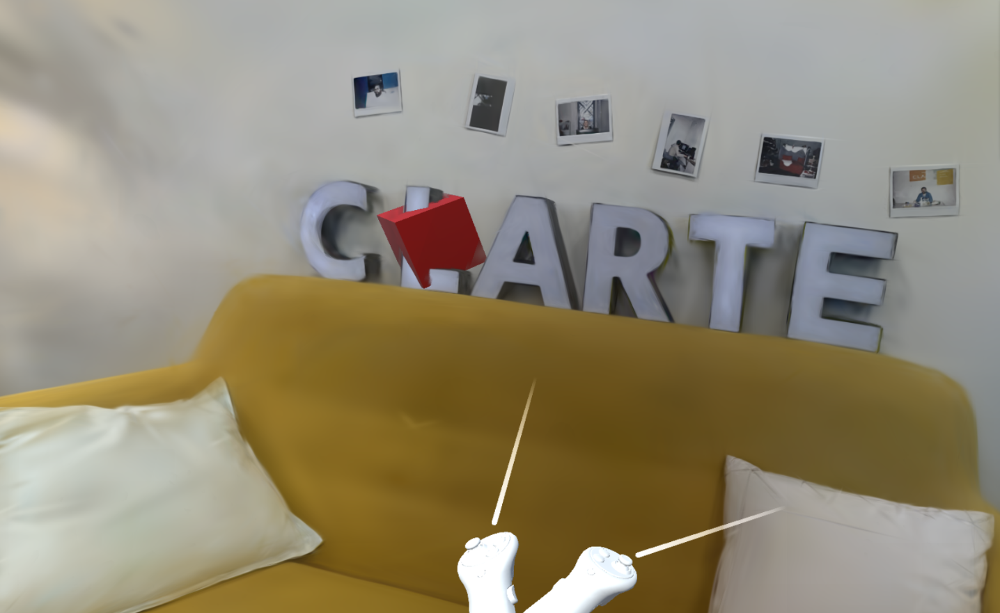
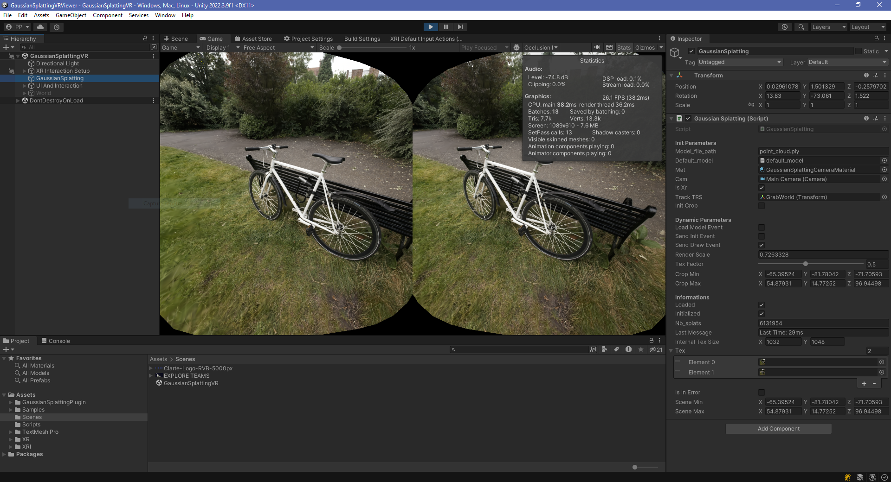

# Gaussian Splatting VR Viewer

At SIGGRAPH 2023 the paper "[**3D Gaussian Splatting for Real-Time Radiance Field Rendering**](https://repo-sam.inria.fr/fungraph/3d-gaussian-splatting/)" by Kerbl, Kopanas, Leimkühler, Drettakis had been released and had impressive speed result comparing to other nerf techniques.

Clarte has integrated the *original CUDA implementation* of [**Differential Gaussian Rasterization**](https://github.com/graphdeco-inria/diff-gaussian-rasterization/tree/main) in a Unity Native Plugin to create a OpenXR viewer of gaussian splatting learned models. The plugin also work without OpenXR to render gaussian splatting in Unity.

> A pre-compiled version of OpenXR viewer for windows is available for testing, you can also compile from source or open the unity project.


Other people have done their own re-implementation of a gaussian splatting renderer for example, [UnityGaussianSplatting](https://github.com/aras-p/UnityGaussianSplatting) from aras-p or [gaussian-splatting-web](https://github.com/cvlab-epfl/gaussian-splatting-web) from cvlab-epfl.

## Installation

### Hardware Requirements

- VR Ready computer
- CUDA-ready GPU with Compute Capability 7.0+ (Geforce > 2060): [Check your card here](https://developer.nvidia.com/cuda-gpus)
- Recommended Geforce > 4070.

### Our hardware was
  - CPU: Intel Core i7-11700K
  - RAM: 16Go
  - GPU: NVIDIA GeForce RTX 3060 Ti
  - VRAM: 8Go

### How to start

Download the last version of windows VR viewer [release](https://github.com/clarte53/GaussianSplattingVRViewerUnity/releases).

Connect your headset and define it as OpenXR default headset.

Launch the executable `GaussianSplattingVRViewer.exe`, it will launch the VR application in OpenXR environment. You should see something like this.



Enjoy gaussian splatting in VR.

### Loading an other model

Download the pre-trained models [**Pre-trained Models (14 GB)**](https://repo-sam.inria.fr/fungraph/3d-gaussian-splatting/datasets/pretrained/models.zip) that you can found on the original git implementation [**GIT - 3D Gaussian Splatting for Real-Time Radiance Field Rendering**](https://github.com/graphdeco-inria/gaussian-splatting).

Copy a `point_cloud.ply` file, for example the one in `models/bicycle/point_cloud/iteration_30000`, near the windows executable `GaussianSplattingVRViewer.exe`, like in the image below.


Launch the executable `GaussianSplattingVRViewer.exe`, it will load the point_cloud.ply file instead of the default integrated model.

Enjoy gaussian splatting in VR again.

By default the rendering resolution of splats is 50% of the headset default resolution, that's why, image is a bit pixelized. It's done for avoiding performance issues, VR need 2 eyes rendering. You can change this during experiment in the menu using the slider.

## Usage

Press one `Grip` button to rotate and move the scene.

Press the two `Grip` buttons to scale the scene. A line appear between the two controllers to indicate the real distance between controllers. This distance is an helper for you to scale the world properly.

You can use `Joystick` button of the left controller to fly in the scene, for example, push the joystick toward and move the controller to fly in that direction.

You can use `Joystick` button of the right controller to turn left, right or back.

The `Menu` button on left controller is used to display the menu below. In this menu, you can change the rendering resolution, see the rendering speed and the number of splats of the model. You can also see quit the application.

Press `escape` or `Q` on the keyboard to quit the application.

For those who knows, we use XR Interaction toolkit with almost default bindings for navigation and interaction. We just change to "controller direction" for fly mode and use scale for 2 hands grabbing.

## Use the plugin or compile from source

Start by cloning the project with recursive submodules.

```
git clone git@github.com:clarte53/GaussianSplattingVRViewerUnity.git --recursive
```

To use plugin in unity see [Unity Project Readme](/GaussianSplattingVRViewer/README.md). You can directly start with unity because a precompiled version of the plugin is included in the unity project.

To compile plugin from source, see [Plugin Compilation Readme](/UnityPlugin/README.md).

## Performances

On the "bicycle" scene from the paper with the point of view below.

- Windows in 1024x1024 (NVIDIA GeForce RTX 3060 Ti):
  - official SiBr viewer: 12ms (80 FPS)
  - In Unity with DirectX: 15ms (67 FPS)
  - In VR (2 eyes, FOV 90): 38ms (26 FPS)
  - [aras-p](https://github.com/aras-p/UnityGaussianSplatting) current work (15/09/2023) DX12: 30ms (30 FPS), DX11: 46ms (21FPS)


In VR more splats are rendered because of the 90° fov instead of 60° and there is two 1024x1024 texture to render, 1 per eye. The VR need also to be synchronized with headset frequency.



# Dependencies

## Differential Gaussian Rasterization

Source used as submodule [Differential Gaussian Rasterization](https://github.com/graphdeco-inria/diff-gaussian-rasterization/tree/main). This code is distributed under [this licence](/GaussianSplattingLicence.md).

```code
@Article{kerbl3Dgaussians,
      author       = {Kerbl, Bernhard and Kopanas, Georgios and Leimk{\"u}hler, Thomas and Drettakis, George},
      title        = {3D Gaussian Splatting for Real-Time Radiance Field Rendering},
      journal      = {ACM Transactions on Graphics},
      number       = {4},
      volume       = {42},
      month        = {July},
      year         = {2023},
      url          = {https://repo-sam.inria.fr/fungraph/3d-gaussian-splatting/}
}
```

## Unity
[Unity](https://unity.com/) is used as main software development.

## Other dependencies

List of other dependencies: [Eigen](https://eigen.tuxfamily.org/index.php?title=Main_Page), [gl3w](https://github.com/skaslev/gl3w), [glew](https://glew.sourceforge.net/).
